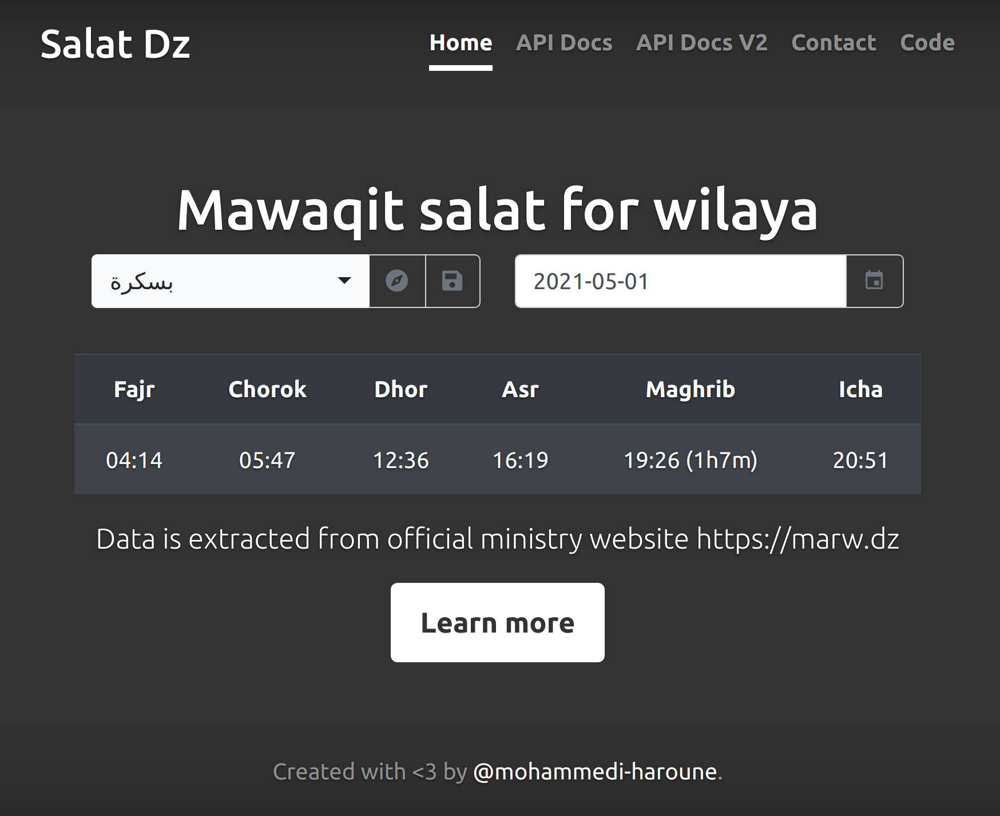
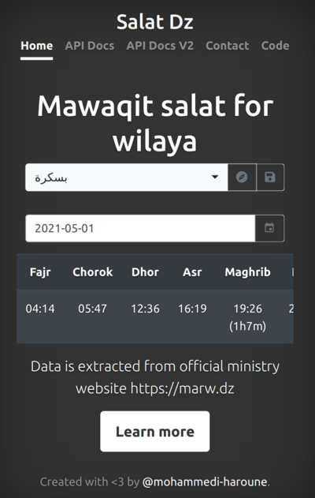

# Salat Dz
Provides correct prayer times based on data published by the ministry of religion

# Usage
```bash
git clone https://github.com/mohammedi-haroune/salat-dz.git
cd salat-dz
virtualenv venv
source venv/bin/activate
pip install -r requirements.txt
FLASK_APP=app.py flask run
```
The web app will be accessible at http://127.0.0.1:5000/

# Story
Living in Algeria, I always struggled to know when does the adhan occur, I used different solutions like Salatuk which gives approximations but not exact times, digging into how does mosques decides when to call for prayer, Imams said the ministry of religion sends a calendar to them, luckily the calendar is available online for public [here](https://www.marw.dz/?q=%D9%85%D9%88%D8%A7%D9%82%D9%8A%D8%AA-%D8%A7%D9%84%D8%B5%D9%84%D8%A7%D8%A9), I downloaded them in my PC/Phone and every time I wanted to check prayer time, I look for the PDF file, open it, scroll down to the page that contain today's information, check the prayer time and do the math between the center of the region and my wilaya to get the prayer time, after a couple of times I decided to stop this shit and do something useful, that's how Salat Dz was built.

# Features

## Web
- Responsive
- Show today's prayer times for all available wilayas
- Show the duration left for next salat
- Geolocalisation to detect current wilaya
- Save selected wilaya

### Screenshot



## Gnome Extension
A Gnome extension is available at https://extensions.gnome.org/extension/4136/salat-dz/, it shows the next salat name and time in the Gnome top bar.

### Screenshot


## REST API
- **Time filters:** filter results by start/end date, number of days and number of weeks
- **Wilaya filter:** filter results by wilaya'a code, arabic name and english name
- **Salat filter:** filter results for a given set of salawat not all of them
- **Next salat:** provide `next` in the `salawat` parameter to return the next salat according the current time

### Examples
* Get Today's prayer times for the given wilayas
```bash
curl http://salat-dz.com/api/v2/mawaqit/?wilayas=07,Alger
```

```json
[
  {
    "date": "2021-05-01",
    "wilaya": {
      "code": "07",
      "arabic_name": "بسكرة",
      "english_name": "Biskra"
    },
    "fajr": "04:14",
    "chorok": "05:47",
    "dhohr": "12:36",
    "asr": "16:19",
    "maghrib": "19:26",
    "icha": "20:51"
  },
  {
    "date": "2021-05-01",
    "wilaya": {
      "code": "16",
      "arabic_name": "الجزائر",
      "english_name": "Alger"
    },
    "fajr": "04:17",
    "chorok": "05:54",
    "dhohr": "12:45",
    "asr": "16:32",
    "maghrib": "19:40",
    "icha": "21:08"
  }
]
```

* Get the next salat

Executed at 18:17 returns Maghrib

```bash
curl http://salat-dz.com/api/v2/mawaqit/?wilayas=07&salawat=next
```

```json
[
  {
    "date": "2021-05-01",
    "wilaya": {
      "code": "07",
      "arabic_name": "بسكرة",
      "english_name": "Biskra"
    },
    "maghrib": "19:26"
  }
]

```

For the complete API documentation visit the Swagger UI at http://salat-dz.com/api/v2

# TODO
- [ ] Paginate result
- [ ] Add date hijria
- [ ] Add analytics to see how people are using it
- [ ] Use OpenAPI 3.0, see this link for converting 2.0 specifications: https://stackoverflow.com/questions/59749513/how-to-convert-openapi-2-0-to-openapi-3-0
- [ ] Add SSL certificate to https://salat-dz.com

## V2
- [ ] Make wilaya argument case insensitive
- [ ] Handle same wilaya values properly, example: wilayas=['biskra', '07', 'biskra']

# Contributing
All contributions are welcomed.

- Fork it (https://github.com/mohammedi-haroune/salat-dz/fork)
- Create your feature branch (git checkout -b feature/fooBar)
- Commit your changes (git commit -am 'Add some fooBar')
- Push to the branch (git push origin feature/fooBar)
- Create a new Pull Request

# License
MIT
